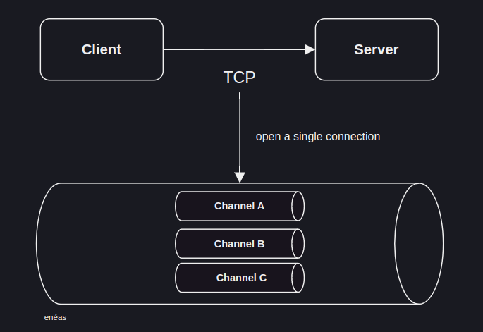
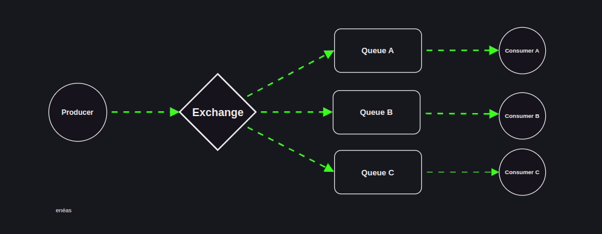
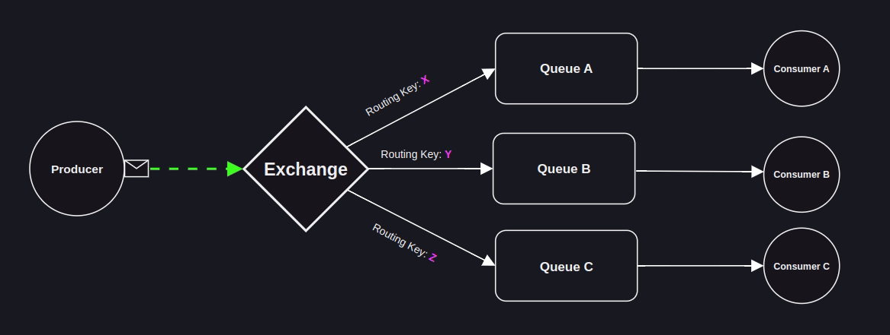

# RabbitMQ

    

## Vantagens

-   É um dos sistemas mais tradicionais de mensageria;
-   Extremamente rápido e confiável;
-   Implementa protocolos AMQP, MQTT, STOMP E HTTP, sendo o mais utilizado o AMQP;
-   Desenvolvido em Erlang;
-   Desacomplamento entre serviços;
-   Por padrão, as mensagens são persistidas em memória;
-   Padrão de mercado, muito utilizado e bastante testado.

## Multiplex connection: como o RabbitMQ trata as conexões

    

Utilizando o protocolo TCP, o RabbitMQ abre apenas uma conexão e cria vários canais dentro dela. Isso porque, se cada canal criasse uma nova conexão, seria bastante custoso, pois, passaria sempre pelo processo de estabelecimento de conexão do TCP: Three-way Handshake.

**Observação:** Para cada canal aberto, abre uma thread.

### Protocolos

| Características | Apache Kafka                              | RabbitMQ                                                                              |
| :-------------- | :---------------------------------------- | :------------------------------------------------------------------------------------ |
| Protocolos      | O Kafka usa um protocolo binário via TCP. | Protocolo avançado de fila de mensagens (AMQP) com suporte via plug-ins: MQTT, STOMP. |

## Como funciona

    

## Exchange

Atua como um roteador, ou seja, um ponto de entrada para as mensagens que são posteriormente encaminhadas para as filas específicas.

### Tipos de exchanges

#### Direct exchange

Roteia mensagens para filas com base em uma chave de roteamento. A mensagem é entregue à fila cuja chave de roteamento está exatamente correspondente à chave de roteamento da mensagem.

    

**Além da direct também temos:**

-   **Fanout:** Distribui todas as mensagens que recebe para todas as filas que estão vinculadas a essa exchange. Ignora a chave de roteamento da mensagem.
-   **Topic:** Similar à Direct Exchange, mas permite um casamento mais sofisticado entre a chave de roteamento e a chave de ligação da fila, usando padrões (wildcards) para rotear mensagens com base em um padrão definido.
-   **Headers:** Roteia mensagens com base em cabeçalhos de mensagens em vez de chaves de roteamento, permitindo combinações complexas de atributos de cabeçalho.

## Queues

-   **FIFO:** o RabbitMQ utiliza o FIFO como padrão, a primeira mensagem que entra, é a primeira mensagem que sai, entretanto, existe uma forma de configurar essa propriedade, porém, se torna algo mais complexo e se faz necesário ter alto domínio do caso de uso.

### Principais propriedades:

-   **Durable:** Por padrão se utiliza filas duráveis, se a fila não for durável, ela vai ser removida assim que broker reiniciar;
-   **Auto-delete:** Quando um consumidor desconecta da fila, automaticamente ela é removida.
-   **Expiry:** Um tempo é definido para receber novas mensagens, caso não receba novas mensagens e/ou o consumidor não esteja conectado, a fila é removida;
-   **Message TTL:** Diz a respeito do tempo de vida útil da mensagem, caso ela não seja consumida em um determinado período de tempo, é perdida e não poderá ser consumida;
-   **Overflow:**
    -   **Drop Head:** Quando a fila entope de mensagens e chega uma nova, a mensagem mais antiga é removida para dar vez a nova que chegou;
    -   **Reject Publish:** Quando a fila entope, as novas mensagens vão sendo rejeitadas, dessa forma, fica claro, que existe uma opção para definir a quantidade máxima de mensagens por fila.
-   **Exclusive:** Apenas o canal que criou a fila pode acessar;
-   **Max length/bytes:** Define a quantidade máxima de mensagens ou bytes por fila e associa a essa opção o Drop Head ou Reject Publish;

### Dead letter queues

-   Algumas mensagens não são entregues, seja por problemas de redes o outros motivos;
-   São encaminhadas para o Exchange específica com uma fila associada, que encaminham as mensagens para uma Dead letter queue;
-   As mensagens nesse estado, podem vir a serem consumidas para possíveis checagens, como se fosse um registro de log;

### Lazy queues

-   As mensagens são armazenadas em disco e caso o broker reinicie, a mensagens não são perdaidas;
-   Muito custosa, pois, exige muito I/O, esse recurso é utilizado geralmente quando são enviadas milhões de mensagens e os consumidores não dão conta de realizar as leituras de forma correta;

  
  Made with 💙 by <a href="https://github.com/venzel">Enéas Almeida</a>

